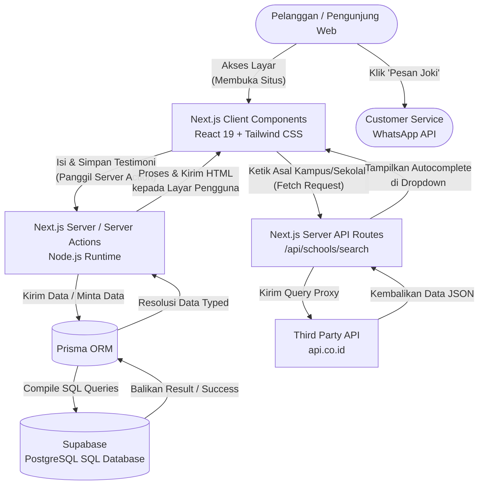

# GasJoki.id - Website Layanan Joki Tugas

## 1. Proyek Apakah Ini?

GasJoki.id adalah website *landing page* dan platform layanan joki tugas (ghostwriting) profesional yang membantu siswa dan mahasiswa untuk menyelesaikan berbagai jenis tugas akademik, mulai dari tingkat sekolah menengah, sarjana, hingga pascasarjana. Website ini awalnya dibangun sebagai halaman statis (SPA), namun kini telah berevolusi menjadi web aplikasi *fullstack* agar dapat menghadirkan interaktifitas yang aman dan dinamis, seperti:
- **Testimoni Dinamis**: Pengguna dapat memberikan testimoni dan *rating* yang langsung tersimpan ke basis data secara *real-time*.
- **Pencarian Institusi**: Terintegrasi dengan API data institusi nasional (`api.co.id`) untuk memberikan autocompletion nama kampus dan sekolah se-Indonesia ketika pelanggan mengisi form ulasan.
- **Form Pemesanan Pintar**: Menyediakan alur terstruktur untuk mendeskripsikan spesifikasi tugas yang mengarah langsung ke WhatsApp customer service dengan format chat otomatis.

## 2. Tech Stack (Teknologi yang Digunakan)

Proyek ini dibangun menggunakan arsitektur modern berbasis SSR (Server-Side Rendering) dan API Routes untuk keamanan data dan performa loading (SEO yang lebih baik).

### Frontend
- **Framework Utama**: [Next.js 16](https://nextjs.org/) (menggunakan App Router)
- **Library Antarmuka**: [React 19](https://react.dev/)
- **Bahasa**: [TypeScript](https://www.typescriptlang.org/) untuk *type safety* penuh
- **Styling**: [Tailwind CSS 3.4](https://tailwindcss.com/)
- **Ikonografi**: [Lucide React](https://lucide.dev/)

### Backend & Datastore
- **Server Environment**: Next.js Node.js (melalui Server Components & Server Actions)
- **Database Relasional**: [PostgreSQL](https://www.postgresql.org/) (Di-host sepenuhnya oleh [Supabase](https://supabase.com/))
- **ORM / Database Client**: [Prisma](https://www.prisma.io/) (Menggunakan driver `@prisma/adapter-pg` untuk optimasi koneksi *pooling*)
- **Third-Party API**: `api.co.id` untuk pencarian endpoint direktori institusi pendidikan.

### Pengembangan & Build
- **Linter**: ESLint & TypeScript ESLint
- **Server Deployment Target**: Disarankan menggunakan Vercel agar mendukung arsitektur Serverless mutakhir.

## 3. Struktur Folder Utama

```text
gasjoki/
├── prisma/
│   ├── migrations/         # Folder riwayat revisi skema database
│   ├── schema.prisma       # Definisi model tabel struktur tabel Supabase
│   └── seed.ts             # Script seeding data sampel testimoni ke dalam database
├── public/                 # Direktori file statis yang diakses secara publik
│   └── images/             # Gambar pendukung desain UI
├── src/
│   ├── app/                # Direktori jantung dari Next.js App Router
│   │   ├── actions/        # Pengeksekusi "Server Actions" (Logika input form/buat testimoni)
│   │   ├── api/            # API Routes (sebagai proxy API.co.id, menghindari kebocoran token)
│   │   ├── favicon.ico
│   │   ├── globals.css     # Deklarasi Tailwind directives 
│   │   ├── layout.tsx      # Komponen kerangka (Root) untuk header metadata aplikasi
│   │   └── page.tsx        # Halaman Landing Page Utama (Homepage)
│   ├── components/         # Direktori kumpulan modul komponen
│   │   ├── layouts/        # Komponen blok layout per-section (Navbar, Testimoni, Hero)
│   │   ├── modals/         # Popup komponen layer atas (Form Testimoni, FAQ, dsb)
│   │   └── ui/             # Komponen kecil guna-ulang (Button, InstitutionSearch bar)
│   └── lib/                # Konfigurasi logic pembantu seperti integrasi object utama Prisma
├── .env                    # (Tersembunyi) Pengaturan Variabel aman/credentials (URL, API KEY)
├── next.config.ts          # Konfigurasi bundler proyek berbasis Next.js
├── package.json            # Repositori library, versi aplikasi, serta shortcut npm (dev, build)
├── tailwind.config.js      # File deklarasi preset penyesuaian khusus framework Tailwind CSS
└── tsconfig.json           # Setelan compiler aturan deteksi error dari TypeScript
```

## 4. Diagram Alir Tech Stack

Arsitektur di bawah ini memvisualisasikan bagaimana komunikasi teknologi tersebut terjadi secara berdampingan.



### Penjelasan Diagram Singkat
1. **Render Awal (Fetch Database)**: Saat `User` memuat halaman website, bagian server Next.js membaca data testimoni tersimpan via **Prisma ORM**, yang menyambung langsung dengan instance **Supabase Postgres**. Halaman SSR dengan struktur **Tailwind UI** diterjemahkan ke peramban.
2. **Pencarian API Proxy**: Karena tidak aman mengekspos kata kunci API eksternal langsung dari *browser*, input sekolah diproses oleh form di *Client*. Setelah pengguna baru mengetikkan lebih dari 5 huruf, sinyal request dikirim ke perantara **Next.js API Route**, baru diteruskan ke **api.co.id** (*External API*) untuk mendapat rekomendasi Dropdown Autocomplete.
3. **Server Action Form**: Saat form pembuatan testimoni diselesaikan, isian terkirim aman ke *Next.js Server Action* yang kemudian memakai konektivitas **Prisma** untuk meregistrasikan baris baru tersebut secara otomatis di pangkalan data backend.

---
**Disclaimer Hukum:** Platform layanan ini memiliki standar kode integritas dan etika yang kuat. Pastikan untuk selalu mematuhi hukum privasi data pada operasional server serta regulasi pendidikan di wilayah Anda masing-masing terkait kompilasi materi tugas klien.
